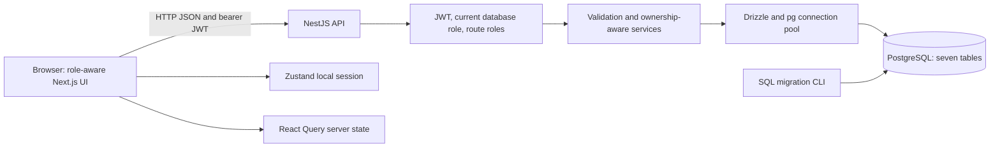

# Engineering audit — 2026-10-05

**Baseline audit history:** subsequent fixes and verification are recorded in [the quality repair report](code-quality-fixes.md); security and billing limitations described below reflect the original baseline where superseded.

The repository now has a verified local end-to-end baseline. This is a portfolio demonstration with synthetic data, not production clinical software. Existing working-tree changes were preserved and completed; comparison with Git HEAD (`48c0bfd`) distinguishes original behavior from the migration already underway. Nothing was committed, pushed, deployed, or applied to cloud infrastructure. No existing application database or Docker volume was reset/deleted.

## Architecture as implemented

The pnpm 9 workspace contains a Next.js 16.3.8/React 19.3 frontend, NestJS 11 API, shared TypeScript contracts, and an unused UI package scaffold. Turbo coordinates app builds/dev. The frontend retains Tailwind, Radix components, React Hook Form/Zod, React Query, and Zustand. PostgreSQL 17 is accessed through Drizzle ORM 0.45.3 and the `pg` pool. Drizzle Kit 0.31.11 generates reviewable SQL migrations.



Public registration always creates a patient account. Login verifies a bcrypt password and issues a one-hour JWT. Protected HTTP requests reload the user's current database role; route guards and service ownership checks constrain access. Patients create their own demographic profile, book, view, and cancel their appointments. Doctors manage their assigned/unassigned appointments and author SOAP notes. Nurses read clinical records and manage visits; front desk registers walk-ins, books for selected patients, and manages the queue. Billing staff/admins create bills and mark payment status. Admin staff-account creation exists through the API, not a separate admin UI.

Queue insertion/reactivation uses a transaction advisory lock to reject duplicate active entries. Call-next uses a transaction and `FOR UPDATE SKIP LOCKED`. PostgreSQL constraints enforce original relationships/uniqueness. Password fields are excluded from public users and relation projections. The Socket.IO gateway accepts authenticated clients and broadcasts a refresh hint only; the UI currently uses HTTP and does not subscribe to it.

Tables: User, Patient, Appointment, Queue, ConsultNote, Billing, AuditLog. AuditLog currently has no automatic writer. Billing and notes retain optional appointment text fields without database foreign keys, matching the original schema; API services validate supplied links. See the [migration plan](database-migration.md) for equivalence and adoption limits.

Docker Compose provides PostgreSQL, an optional pgAdmin profile, a one-shot migration service, the API, and the standalone frontend. CI verification is independent of the manually triggered ECR publishing/deployment workflow. Infrastructure retains the original single-EC2 kubeadm cluster, Terraform AWS resources, Ansible scaffold, Kubernetes workloads, ECR, and Prometheus/Grafana assets.

## Findings and changes

| Class | Original problem / root cause | Result |
| --- | --- | --- |
| Blocking | Setup/build/runtime paths and package-manager/container configuration were inconsistent; root dev killed processes on ports 3000/3001 | Standardized pnpm 9 and Node requirements, removed unconditional port kills, fixed compiled backend and standalone frontend startup, and packaged static assets/migrations |
| Blocking | Prisma-dependent runtime and no committed fresh database migration or safe adoption workflow | Replaced Prisma with typed Drizzle schema/queries; added SQL migration/snapshot, migrate/generate/baseline/seed CLIs and data-preservation tests |
| Blocking | Patient booking used inconsistent user/profile identifiers and lacked a complete patient-profile path | Real patient profile creation and correct patient IDs; legacy user-ID booking remains accepted for compatibility; staff select patients explicitly |
| Blocking | User/billing/clinical routes lacked consistent guard coverage; public registration accepted requested staff roles; user responses/doctor relation includes exposed hashes | Added role and ownership enforcement, patient-only public registration, current-role JWT validation, and safe projections; billing role can read patient selections but cannot edit/delete patient profiles |
| Blocking | Profile save sent no bearer header; frontend password policy disagreed with API | Authenticated profile updates, shared user contract, matching eight-character validation; browser regression reproduced failure before repair |
| Important | Impossible calendar dates were accepted and null email updates reached a NOT NULL failure | Strict calendar validation and partial DTO validation of nonnullable fields; reproduced invalid date 201 and null update 500 before repair |
| Important | Bill/note updates could break appointment-to-patient consistency | Validate merged appointment links on both creation and update; repeated PAID updates retain the original payment timestamp |
| Important | Queue numbering/calling lacked transaction protection; status UI included a nonexistent enum; reactivation could duplicate active patients | Serialized insertion and reactivation, row-locking call-next, valid enum choices, conflict responses and integration coverage |
| Important | SOAP author IDs could be supplied by callers and writes were insufficiently restricted | Author comes from authenticated doctor; author/admin checks for modification/deletion; nurse reads supported |
| Important | Original seed deleted records in all seven tables and had a hardcoded demo password | Additive transaction seed with explicit password, production refusal, and password/data idempotence verification |
| Important | Navigation included placeholder interactions, role-inappropriate pages, weak mobile layout, incomplete error/empty/loading states, and no billing workflow | Coherent role navigation and route guards, real billing, responsive form/list layouts, accessible dialog/labels, dashboard/query error handling, cancellation/completion controls and accurate active-queue counts |
| Important | Next/React and transitive dependencies had advisories; build tooling also had vulnerabilities | Updated app dependencies/lockfile, scoped patched js-yaml override, updated Turbo, removed unused Nodemon; final production audit clean |
| Important | Compose lacked migration/health sequencing; container runtime configuration and browser API URL could diverge | PostgreSQL health dependency, successful migration dependency, explicit browser build argument, loopback host ports, nonroot app containers; Docker context excludes nested environment files, infrastructure state, local agent directories, and generated reports |
| Important | Deployment ran on pushes; Kubernetes API startup lacked migration ordering and production CORS configuration | Manual publish/deploy inputs, production deployment environment, migration init container updated with API image, bootstrap CORS and required-variable validation |
| Important | OIDC subject assumptions depend on repository age/settings | Terraform accepts the documented legacy and immutable-ID subject formats for this repository's devops branch; live claims/role assumption remain unverified |
| Important | Monitoring script printed Grafana credentials | Removed credential printing; credentials must be retrieved privately |
| Improvement | README links targeted missing reports; app docs were starter text; Postman had empty bodies, missing routes/auth, and obsolete user lookup | Accurate setup/app docs, this report, migration guidance, example Postman bearer environment, useful bodies and login token capture |
| Improvement | Empty UI package exported a nonexistent source file and had a lint command targeting no source files; entity/template assets were scaffolding | Removed invalid exports and the dead empty-package lint command; application/test lint checks remain active. Other harmless scaffolding retained |

Original unit tests largely checked dependency construction. Those smoke tests remain, with mocks isolating dependencies; meaningful auth/role tests and real PostgreSQL/browser tests now cover behavior. Checks have not been disabled to hide failures. The inherited ESLint/Biome policies remain in effect; formatting fixes include the added startup script/test files. Generated Playwright output is excluded from formatting, not application/test source.

## Executed verification

Environment: NixOS, Node **24.21.0**, selected pnpm **9.0.0**, PostgreSQL **17** Docker container. Docker builds independently installed dependencies and built with Node **22**. Only synthetic isolated databases were used. Native API/browser tests used the existing audit PostgreSQL container on loopback 15439; migration lifecycle tests created additional randomly named databases. The Compose project uses its own volume.

| Command / scenario | Result |
| --- | --- |
| `pnpm install --frozen-lockfile` | PASS; lockfile reproducible, normal-user install |
| `pnpm format:check` / `pnpm lint` | Initial attempt FAILED because NixOS could not launch the downloaded Biome ELF; backend checks and equivalent frontend checks subsequently passed as below |
| `pnpm --filter backend format:check` | PASS |
| `pnpm --filter backend lint` | PASS |
| Biome `format` and `check`, from apps/frontend through the Nix glibc loader | PASS; one existing sidebar preference-cookie warning, no errors |
| `pnpm typecheck` | PASS for both applications |
| `pnpm test` | PASS; 15 suites, 19 unit tests |
| `pnpm --filter backend db:migrate` | PASS on fresh dedicated databases |
| `pnpm --filter backend db:generate` | PASS; seven tables, no schema/snapshot drift, no new migration needed |
| `pnpm --filter backend test:e2e` | PASS; two suites, nine tests, including database lifecycle and eight application workflow tests |
| Migration lifecycle | PASS; fresh/repeated migrate, repeated seed, baseline/repeated baseline with legacy rows, unchanged data digest, safe refusal/rollback on mismatch or unknown history |
| `pnpm build` | PASS; production backend and frontend builds |
| `pnpm --filter frontend test:e2e` with Nix Chromium | PASS against actual production app builds and PostgreSQL; six roles, registration/login, profile edit/create, booking, completion/cancellation, SOAP notes, walk-in, queue, billing/payment, forbidden page, API outage and invalid-session redirect |
| Browser responsive/visual checks | PASS; landing widths 320/390/768/1280; mobile sidebar and no overflow for appointments/queue; desktop/mobile screenshots inspected |
| `docker build -f Dockerfile.backend -t hospital-backend:audit .` | PASS |
| `docker build -f Dockerfile.frontend -t hospital-frontend:audit .` | PASS |
| `docker compose --env-file .env.example config --quiet` | PASS |
| `docker compose -p hospital-audit-resume --env-file <private-test-env> up --build -d` | PASS on a fresh isolated volume; final source rebuilt and started, PostgreSQL healthy and migration service exited successfully |
| `docker compose ... exec -e NODE_ENV=development -e SEED_PASSWORD=<test-value> backend node dist/src/database/seed.js` | PASS; demo accounts/profile available, existing records preserved |
| Node/Playwright smoke test against Compose frontend 3000 / API 8080 | PASS; registration, login, patient profile and appointment booking sent real browser requests to the API, zero page errors; billing profile edit returned 403 after final rebuild (earlier image returned 200) |
| `pnpm audit --prod --json` | PASS; zero reported advisories at audit time |
| `pnpm audit --json` | FAIL advisory status; one moderate and one low esbuild finding through development tooling, no high/critical findings |
| `terraform -chdir=terraform fmt -check` and `validate` | PASS; provider initialization was available from the earlier local audit |
| `ansible-playbook -i ansible/inventory.ini ansible/bootstrap-kubeadm.yaml --syntax-check` | PASS |
| `bash -n scripts/bootstrap-kubeadm.sh scripts/bootstrap-observability.sh scripts/sync-to-ec2.sh` | PASS |
| `kubectl --kubeconfig=/dev/null create --dry-run=client --validate=false -f k8s/workloads -o name` | NOT VERIFIED; Kubernetes discovery still requires an API server, none at localhost:8080; no cluster contacted or mutated |
| Git/file/history secret heuristics | Tracked files and all 81 reachable commits checked for common private-key/AWS/GitHub/JWT formats; values withheld; see security section |
| `git diff --check` | PASS |
| GitHub-hosted CI, AWS apply/deploy, live Kubernetes/monitoring | NOT RUN; outside authorized local work |

The UI regression and API regression tests failed before repair and passed afterward. The added impossible-date assertion initially interrupted fixture creation, so later failures in that run were consequential test failures, not independent application defects.

The temporary Compose project was stopped after verification to free the standard ports. Its containers and named database volume were retained; no `down -v`, drop, reset, or truncation was used. The pre-existing audit PostgreSQL container was left as found. Local fixture/migration databases also remain for inspection. The private temporary Compose environment lives outside Git and its values are not included in this report.

On NixOS, the package registry's Biome executable expects a generic Linux loader. The equivalent checks used the locally installed glibc loader, preserving all lint/format rules:

```sh
# Run from apps/frontend. Substitute the loader path from your Nix installation.
/nix/store/<glibc>/lib/ld-linux-x86-64.so.2 \
  ../../node_modules/.pnpm/@biomejs+cli-linux-x64@2.2.0/node_modules/@biomejs/cli-linux-x64/biome check
# Repeat with `format` for the formatting check.
```

Linux CI/container environments use the normal pnpm scripts. Nix browser tests set `PLAYWRIGHT_CHROMIUM_EXECUTABLE_PATH` to the Nix Chromium executable. The local pnpm launcher also emitted a settings warning before selecting pnpm 9; installed package versions and lockfile were checked independently.

## Remaining issues

**Local blockers:** none identified after the executed baseline checks. A real existing database may differ from the fixture and must be backed up, inspected, and checked before adoption. Database triggers/policies/extensions are outside automated compatibility checks.

**Important before production-like use:** establish HTTPS, login/registration rate limits, clinical record-access policy, audit-log writes, backup/restore drills, monitoring and database readiness; decide secure session storage/token revocation and account recovery; review error observability without patient/credential leakage. Current JWT persistence in localStorage is exposed to successful XSS. Staff have broad record access according to current roles. There is no automatic token revocation on logout. Websocket authentication checks the signed token, whereas HTTP reloads the user/role; it emits no clinical data, and the UI does not currently rely on it.

Infrastructure still has public HTTP application/Grafana NodePorts, a single host/database replica, hardcoded image references/operator IPs and paths, no TLS ingress, no verified backups, limited resource/probe configuration, and a short-lived ECR pull secret requiring renewal. Historical image tags in manifests must be replaced with newly built Drizzle-capable images before any rollout. Ansible performs only kernel/swap/sysctl preparation, not the complete shell bootstrap. Shell bootstrap is host-mutating and not a general idempotent configuration system. Cloud workflow execution additionally requires configured OIDC/ECR/SSH variables, migration-compatible images, CORS, and an explicit operational review. Production environment approval protection must be configured in GitHub; YAML alone does not guarantee it.

GitHub's OIDC subject can include immutable owner/repository IDs for newly created or opted-in repositories. The trust policy retains both formats for the same repository and branch; inspect the actual claims privately and consider exact immutable IDs before applying it. This follows [GitHub's current AWS OIDC guidance](https://docs.github.com/en/actions/how-tos/secure-your-work/security-harden-deployments/oidc-in-aws). The earlier immutable-format policy was not classified as inherently malformed, and no live assumption was attempted.

**Optional improvements:** pagination/filtering/search; FK lookup/performance indexes based on query measurements; integer cents or decimal money with an explicit data migration; doctor availability/collision rules; stricter visit-status transitions and retention policy; patient demographic editing; admin UI; removal of harmless scaffold/assets; automated accessibility audit and larger browser matrix. Prescriptions, labs, payment gateways, patient clinical-note export, and automatic clinical audit trails are not implemented.

## Security and reliability evidence

No private-key, AWS access-key, GitHub-token, or literal-JWT candidates were found in the current tracked files or reachable history using the documented heuristic scan. This is not an exhaustive secret-detection guarantee. Example credentials are explicit local placeholders; seed credentials require configuration and stored hashes are excluded from API responses. AWS account numbers/public IPs are infrastructure identifiers, not credentials. No sensitive values were printed by the audit scans. The previous hardcoded demo credentials must never be reused for a real deployment.

Production dependencies report no current advisories. Development-only esbuild advisories remain through Drizzle Kit's legacy loader and tsx; avoid exposing these development servers to untrusted networks. A forced incompatible transitive override was not introduced. Track upstream compatible tool updates. Audits are point-in-time dependency checks, not proof of application security.

The `/health` endpoint is liveness only. Pool connectivity is checked during API startup, but ongoing database readiness and metrics are future work. HTTP failures are surfaced in query/error states and mutation notifications. API conflict errors do not disclose SQL or passwords. Migration/seed CLI failures exit nonzero without resetting anything.

## Recommended next steps

1. Keep CI green on the final branch and run a fresh setup from the README on another machine.
2. Make a focused portfolio demonstration with synthetic users/data, workflow screenshots, architecture, and the migration preservation tests.
3. Add clinical audit writes and a measured record-access policy; then session/rate-limit hardening and backup/restore tests.
4. Add realistic appointment availability and deliberate status-transition rules; improve query pagination/indexes when measurements justify them.
5. Review and test the existing infrastructure in an explicitly approved disposable environment before any deployment; configure HTTPS, protected deployment approvals, CORS, credentials, migration ordering, image tags, and readiness.

Implementation choices were checked against the installed packages and primary documentation: [Drizzle PostgreSQL existing databases](https://orm.drizzle.team/docs/get-started/postgresql-existing), [Drizzle migrations](https://orm.drizzle.team/docs/migrations), [Drizzle PostgreSQL columns/runtime defaults](https://orm.drizzle.team/docs/column-types/pg), and [Next.js environment variables](https://nextjs.org/docs/pages/guides/environment-variables). Next.js browser API URLs are build-time values; changing a container environment after building does not change that URL.

## UI/UX follow-up

After the working baseline, the user authorized a workflow-focused interface redesign. See [UI/UX decisions and verification](ui-ux.md) for the resulting screens, real API flows, accessibility improvements, and separate verification evidence. The audit results above describe the preceding baseline.

## Code-quality follow-up

The later [frontend-to-backend code-quality audit](code-quality.md) reproduced concurrent appointment assignment, terminal-status, validation, overdue billing, and cross-session freshness defects outside the preceding workflow suite. These remain unfixed; passing baseline checks should not be treated as evidence that concurrent clinical workflows are ready.
